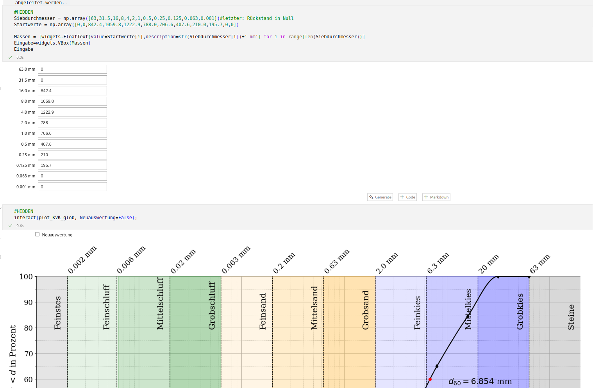

<!--

author:  Sebastian Zug, Andre Dietrich, Thomas Nagel

import: https://raw.githubusercontent.com/liaTemplates/PyScript/main/README.md

persistent: true

@path
``` python @PyScript.env
- paths:
  - @0
```
@end

@onload
let path = window.location.search.slice(1).split("/")
path.pop()
path = path.join("/")

const preload = `
- matplotlib
- scipy
- numpy
- paths:
  - ${path}/functions.py
`

const pyEnv = document.createElement("py-env")

pyEnv.innerHTML = preload

document.body.appendChild(pyEnv)
@end

value_input: <span style="display: inline-block; min-width: 9rem">@1:</span> <script 
                input="range"
                output="@0"
                value=@2
                input-always-active
                min="@3"
                max="@4"
                step="0.1"
                modify="false"
            >
            const elements = document.getElementsByClassName("inert");

            for (let i = 0; i < elements.length; i++) {
                elements[i].setAttribute("inert", "");
            }

            setTimeout(() => {
                for (let i = 0; i < elements.length; i++) {
                    elements[i].removeAttribute("inert");
                }
            }, 500);

            @input
            </script>

@python_evaluate
<script class="inert" style="display: block" modify="false" run-once>
`LIASCRIPT:
\`\`\` python @PyScript.repl
@0
\`\`\`
`
</script>
@end

@python_run
<script class="inert" style="display: block" modify="false" run-once>
`LIASCRIPT:
\`\`\` python @Pyodide.exec
@0
\`\`\`
`
</script>
@end
-->

[](https://liascript.github.io/course/?https://raw.githubusercontent.com/LiaPlayground/Jupyter2Liascript/refs/heads/main/presentation.md)

[](https://liascript.github.io/LiveEditor/?/show/file/https://raw.githubusercontent.com/LiaPlayground/Jupyter2Liascript/refs/heads/main/presentation.md)


# Beschreibung von Kornverteilungskurven


Im Zuge der Bestimmung einer Sieblinie werden Siebrückstände $m_i$ ermittelt. Die einzelnen zu den Siebdurchmessern $d_i$ gehörigen Siebrückstände $m_i$ können nun auf die Gesamtmasse $m_\text{d} = \sum m_i$ (Annahme vernachlässigbarer Siebverluste) bezogen werden, womit die Masseanteile

$$
    x_i = \frac{m_i}{m_\text{d}}
$$

ermittelt werden. Diese werden typischerweise in einer Summenkurve

$$
    F(d_i) = \sum \limits_{k=1}^i x_i
$$

aufgetragen. Dabei wird aufgrund der über Größenordnungen verteilten Korndurchmesser eine halblogarithmische Darstellung gewählt (siehe folgende Abbildung, rechts). Feinanteile, die nicht durch Siebung näher untersucht werden, sind nicht mit dargestellt. In der linken Abbildung sind die Masseanteile selbst und das zugehörige Histogramm der Masseverteilung dargestellt.

Mithilfe der Körnungslinie bzw. Kornverteilungskurve können die dominierenden Bestandteile (T, U, S, G) ermittelt werden. Des weiteren können die Ungleichförmigkeitszahl

$$
    C_\text{U} = \frac{d_{60}}{d_{10}}
$$

und die Krümmungszahl

$$
    C_\text{C} = \frac{d_{30}^2}{d_{10}\ d_{60}}
$$

abgeleitet werden. 

> In den Jupyter Notebooks erfolgt die Eingabe der Massen pro Siebdurchmesser als ein interaktives Element, in den die Siebrückstände eingegeben werden können und die Kornverteilungskurve neu berechnet wird.
> 
> 
>
> Ziel war es diesen Prozess in LiaScript zu überführen. Dabei wurde die Berechnung der Kornverteilungskurve in eine separate Python-Datei ausgelagert, um den Code übersichtlich zu halten.
>
> Der LiaScript Dokumenteninhalt kann mit folgendem Link im LiveEditor geöffnet werden: https://liascript.github.io/course/?https://raw.githubusercontent.com/LiaPlayground/Jupyter2Liascript/refs/heads/main/presentation.md

## Variante 1: Interaktive Darstellung ohne Widgets

> Änderungen an den Körnungsparametern können direkt im Python Code vorgenommen werden. Für die Ausführung des Codes wird der grüne Button in der Ecke des Codeblocks aktiviert.
> 
> Achtung: Die Berechnung dauert einige Sekunden. Falls ein `JsException` Fehler auftritt, bitte mit F5 noch mal laden.


``` python @PyScript.repl
import matplotlib.pyplot as plt
import matplotlib.tri as tri
import numpy as np
import scipy as sp
from scipy import interpolate
from matplotlib.colors import SymLogNorm
from functions import *

Siebdurchmesser = np.array([63,31.5,16,8,4,2,1,0.5,0.25,0.125,0.063,0.001])
Startwerte = np.array([0,0,842.4,1059.8,1222.9,788.0,706.6,407.6,210.0,195.7,0,0])
plot_KVK_glob(True, Startwerte, Siebdurchmesser)
plt.show()
plt
```

## Variante 2: Widget-basierte Eingaben der Parameter

> Die Einstellung erfolgt nicht Code basiert sondern über Slider. Die Darstellung im Code wird automatisch aktualisiert, sobald der Werte geändert wurden. Danach kann der Code wieder ausgeführt werden.
>
> Achtung: Die Berechnung dauert einige Sekunden. Falls ein `JsException` Fehler auftritt, bitte mit F5 noch mal laden.

@value_input(a,$63.0\ \text{mm}$,0,0,2000) \
@value_input(b,$31.5\ \text{mm}$,0,0,2000) \
@value_input(c,$16.0\ \text{mm}$,842.4,0,2000) \
@value_input(d,$ 8.0\ \text{mm}$,1059.8,0,2000) \
@value_input(e,$ 4.0\ \text{mm}$,1222.9,0,2000) \
@value_input(f,$ 2.0\ \text{mm}$,788.0,0,2000) \
@value_input(g,$ 1.0\ \text{mm}$,706.6,0,2000) \
@value_input(h,$ 0.5\ \text{mm}$,407.6,0,2000) \
@value_input(i,$ 0.25\ \text{mm}$,210.0,0,2000) \
@value_input(j,$ 0.125\ \text{mm}$,195.7,0,2000) \
@value_input(k,$ 0.063\ \text{mm}$,0,0,2000) \
@value_input(l,$ 0.001\ \text{mm}$,0,0,2000)


``` python @python_evaluate
import matplotlib.pyplot as plt
import matplotlib.tri as tri
import numpy as np
import scipy as sp
from scipy import interpolate
from matplotlib.colors import SymLogNorm
from functions import *
input_values = [@input(`a`), @input(`b`), @input(`c`), @input(`d`), @input(`e`), @input(`f`), @input(`g`), @input(`h`), @input(`i`), @input(`j`), @input(`k`), @input(`l`)]

Siebdurchmesser = np.array([63,31.5,16,8,4,2,1,0.5,0.25,0.125,0.063,0.001])
Startwerte = np.array(input_values)
plot_KVK_glob(True, Startwerte, Siebdurchmesser)
plt.show()
plt
```


## Variante 3: KI basierte Umsetzung in JavaScript

> Ausgehend von der existierenden Implementierung in Python wurde ein JavaScript-Code generiert. Die Realsierung illustriert den Geschwindigkeitsvorteil bei der nativen Ausführung von JavaScript im Browser.

@value_input(a,$63.0\ \text{mm}$,0,0,2000) \
@value_input(b,$31.5\ \text{mm}$,0,0,2000) \
@value_input(c,$16.0\ \text{mm}$,842.4,0,2000) \
@value_input(d,$ 8.0\ \text{mm}$,1059.8,0,2000) \
@value_input(e,$ 4.0\ \text{mm}$,1222.9,0,2000) \
@value_input(f,$ 2.0\ \text{mm}$,788.0,0,2000) \
@value_input(g,$ 1.0\ \text{mm}$,706.6,0,2000) \
@value_input(h,$ 0.5\ \text{mm}$,407.6,0,2000) \
@value_input(i,$ 0.25\ \text{mm}$,210.0,0,2000) \
@value_input(j,$ 0.125\ \text{mm}$,195.7,0,2000) \
@value_input(k,$ 0.063\ \text{mm}$,0,0,2000) \
@value_input(l,$ 0.001\ \text{mm}$,0,0,2000)

<script style="display: block">
// Hilfsfunktionen

// Erzeugt einen Array mit linearen Werten von start bis end in n Schritten.
function linspace(start, end, n) {
  const arr = [];
  const step = (end - start) / (n - 1);
  for (let i = 0; i < n; i++) {
    arr.push(start + step * i);
  }
  return arr;
}

// Findet den Index im Array, dessen Wert am nächsten an "value" liegt.
function findIdxOfNearest(array, value) {
  let minDiff = Infinity;
  let idx = -1;
  array.forEach((d, i) => {
    const diff = Math.abs(d - value);
    if (diff < minDiff) {
      minDiff = diff;
      idx = i;
    }
  });
  return idx;
}

function pchipInterpolator(xs, ys) {
  const n = xs.length;
  const h = Array(n - 1).fill(0).map((_, i) => xs[i + 1] - xs[i]);
  const delta = Array(n - 1).fill(0).map((_, i) => (ys[i + 1] - ys[i]) / h[i]);

  const m = Array(n).fill(0);

  for (let k = 1; k < n - 1; k++) {
    if (delta[k - 1] * delta[k] > 0) {
      const w1 = 2 * h[k] + h[k - 1];
      const w2 = h[k] + 2 * h[k - 1];
      m[k] = (w1 + w2) / (w1 / delta[k - 1] + w2 / delta[k]);
    } else {
      m[k] = 0;
    }
  }

  m[0] = delta[0];
  m[n - 1] = delta[n - 2];

  return function(x) {
    let i = n - 2;
    for (let j = 0; j < n - 1; j++) {
      if (x >= xs[j] && x <= xs[j + 1]) {
        i = j;
        break;
      }
    }

    const h_i = h[i];
    const t = (x - xs[i]) / h_i;

    const h00 = (1 + 2 * t) * (1 - t) ** 2;
    const h10 = t * (1 - t) ** 2;
    const h01 = t ** 2 * (3 - 2 * t);
    const h11 = t ** 2 * (t - 1);

    return h00 * ys[i] + h10 * h_i * m[i] + h01 * ys[i + 1] + h11 * h_i * m[i + 1];
  };
}


// Berechnet d_n: Für einen gegebenen Anteil (z. B. 10, 30, 60) wird in d_new (im Log‑Raum)
// der Index gesucht, bei dem der interpolierte Wert am nächsten an Anteil liegt.
function d_n(Anteil, d_new, interpFunc) {
  // Erzeuge das Array der interpolierten y-Werte
  const yVals = d_new.map(x => interpFunc(x));
  const idx = findIdxOfNearest(yVals, Anteil);
  return Math.exp(d_new[idx]);
}

// Berechnet die Masseanteile (Relativanteile der Siebmassen).
function masseanteile(siebMassen) {
  const sum = siebMassen.reduce((a, b) => a + b, 0);
  return siebMassen.map(v => v / sum);
}

// Berechnet den Siebdurchgang: Die Massenanteile werden (von hinten) kumulativ aufsummiert,
// wobei das letzte Element weggelassen wird.
function siebdurchgang(massenanteileArr) {
  // Array umkehren
  const rev = massenanteileArr.slice().reverse();
  const cum = [];
  rev.forEach((v, i) => {
    if (i === 0) {
      cum.push(v);
    } else {
      cum.push(cum[i - 1] + v);
    }
  });
  // Letztes Element weglassen und wieder umkehren
  cum.pop();
  return cum.reverse();
}


// Hauptfunktion, die das ECharts‑Objekt erzeugt.
// inputValues: Array mit den Siebmassen (Startwerte)
// siebdurchmesser: Array der Siebdurchmesser (in mm), z. B. [63,31.5,16,8,4,2,1,0.5,0.25,0.125,0.063,0.001]
function plotKVKGlob(inputValues, siebdurchmesser) {
  // 1. Berechnungen analog zum Python-Skript
  const m_i = inputValues;  
  const dm_i = masseanteile(m_i);
  const kumMasseAnteile = siebdurchgang(dm_i); // Länge: siebdurchmesser.length - 1

  // Wir arbeiten nur mit den ersten (n-1) Siebdurchmessern
  const siebPart = siebdurchmesser.slice(0, siebdurchmesser.length - 1);
  // Berechne den Logarithmus der Siebdurchmesser (im Original: np.log)
  const logSieb = siebPart.map(d => Math.log(d));
  
  // Für die Interpolation (wie im Python-Code werden die Arrays "umgedreht")
  const xsInterp = logSieb.slice().reverse(); 
  const ysInterp = kumMasseAnteile.slice().reverse().map(v => v * 100);
  
  // Erstelle die Interpolationsfunktion (hier linear interpoliert)
  const interpFunc = pchipInterpolator(xsInterp, ysInterp);
  
  // Erzeuge d_new als linspace im Log‑Raum (hier 1000 Punkte statt 10000 aus Gründen der Performance)
  const d_new = linspace(Math.min(...logSieb), Math.max(...logSieb), 1000);
  
  // Berechne die interpolierten Daten: x = exp(d_new), y = interpFunc(d_new)
  const dataLine = d_new.map(x => [Math.exp(x), interpFunc(x)]);
  
  // Originaldaten (als Punkte)
  const originalData = siebPart.map((d, i) => [d, kumMasseAnteile[i] * 100]);
  
  // Bestimme d10, d30, d60
  const d10 = d_n(10, d_new, interpFunc);
  const d30 = d_n(30, d_new, interpFunc);
  const d60 = d_n(60, d_new, interpFunc);
  
  // Bestimme Gradationsparameter Cu und Cc
  const Cu = d60 / d10;
  
  const Cc = (d30 * d30) / (d60 * d10);

  
  // 2. Aufbau des ECharts‑Optionsobjekts

  const option = {
    tooltip: {
      trigger: 'axis'
    },
    xAxis: {
        type: 'log',
        name: 'Korndurchmesser d in mm',
        nameLocation: 'middle',  // Positioniert den Achsentitel in der Mitte
        nameGap: 25,             // Abstand zwischen Achse und Titel (anpassbar)
        nameTextStyle: { fontSize: 18 },
        min: 0.001,
        max: 200,
        axisLabel: { formatter: '{value}' }
    },
    yAxis: {
      type: 'value',
      name: 'Siebdurchgang in %',
      nameLocation: 'middle',  // Positioniert den Achsentitel in der Mitte
      nameGap: 25,             // Abstand zwischen Achse und Titel (anpassbar)
      nameTextStyle: { fontSize: 18 },
      min: 0,
      max: 100,
      axisLabel: { formatter: '{value}' }
    },
    grid: {
      left: '10%',
      right: '10%',
      bottom: '10%',
      top: '10%'
    },
    series: [
      {
        name: 'Interpolierte Kurve',
        type: 'line',
        data: dataLine,
        smooth: true,
        lineStyle: { color: '#000' },
        showSymbol: false,
        // Definiere farbige Bereiche (markArea) analog zu den axvspan-Bereichen
        markArea: {
          silent: true,
          data: [
            // [Start, Ende] jeweils als { xAxis, yAxis } – y von 0 bis 100
            [{ xAxis: 0.001, yAxis: 0, itemStyle: { color: 'rgba(128,128,128,0.2)' } }, { xAxis: 0.002, yAxis: 100 }],
            [{ xAxis: 0.002, yAxis: 0, itemStyle: { color: 'rgba(0,128,0,0.1)' } }, { xAxis: 0.0063, yAxis: 100 }],
            [{ xAxis: 0.0063, yAxis: 0, itemStyle: { color: 'rgba(0,128,0,0.2)' } }, { xAxis: 0.02, yAxis: 100 }],
            [{ xAxis: 0.02, yAxis: 0, itemStyle: { color: 'rgba(0,128,0,0.3)' } }, { xAxis: 0.063, yAxis: 100 }],
            [{ xAxis: 0.063, yAxis: 0, itemStyle: { color: 'rgba(255,165,0,0.1)' } }, { xAxis: 0.2, yAxis: 100 }],
            [{ xAxis: 0.2, yAxis: 0, itemStyle: { color: 'rgba(255,165,0,0.2)' } }, { xAxis: 0.63, yAxis: 100 }],
            [{ xAxis: 0.63, yAxis: 0, itemStyle: { color: 'rgba(255,165,0,0.3)' } }, { xAxis: 2, yAxis: 100 }],
            [{ xAxis: 2, yAxis: 0, itemStyle: { color: 'rgba(0,0,255,0.1)' } }, { xAxis: 6.3, yAxis: 100 }],
            [{ xAxis: 6.3, yAxis: 0, itemStyle: { color: 'rgba(0,0,255,0.2)' } }, { xAxis: 20, yAxis: 100 }],
            [{ xAxis: 20, yAxis: 0, itemStyle: { color: 'rgba(0,0,255,0.3)' } }, { xAxis: 63, yAxis: 100 }],
            [{ xAxis: 63, yAxis: 0, itemStyle: { color: 'rgba(128,128,128,0.3)' } }, { xAxis: 200, yAxis: 100 }]
          ]
        },
        // Zeichnet vertikale Hilfslinien an den angegebenen Siebdurchmessern
        markLine: {
          symbol: 'none',
          lineStyle: { type: 'dashed', width: 1 },
          data: [
            { xAxis: 0.0020.toFixed(6) },
            { xAxis: 0.0063.toFixed(6) },
            { xAxis: 0.0200.toFixed(6) },
            { xAxis: 0.0630.toFixed(6) },
            { xAxis: 0.2000.toFixed(6) },
            { xAxis: 0.6300.toFixed(6) },
            { xAxis: 2.0000.toFixed(6) },
            { xAxis: 6.3000.toFixed(6) },
            { xAxis: 20.0000.toFixed(6) },
            { xAxis: 63.0000.toFixed(6) }
          ]
        }
      },
      {
        name: 'Originaldaten',
        type: 'scatter',
        data: originalData,
        itemStyle: { color: '#000' }
      },
      {
        // Zusätzliche Annotationen (Gradationscharakterisierung)
        name: 'Annotations',
        type: 'scatter',
        data: [],
        markPoint: {
          symbol: '',
          itemStyle: {
            color: 'transparent',   // Fill color transparent
            borderColor: 'transparent'
          },
          label: {
            fontSize: 18,
            color: '#000'
          },
          data: [
            {
              coord: [8, 5],
              label: { formatter: "{normal|C}{sub|U} = " + Cu.toFixed(1) + ", {normal|C}{sub|C} = " + Cc.toFixed(1),
                rich: {
                  normal: { fontSize: 14 },
                  sub:    { fontSize: 10, verticalAlign: 'bottom' }
              }
              }
            }
          ]
        }
      },
      {
        name: 'Wichtige Punkte',
        type: 'scatter',
        data: [
          [d10,10],
          [d30,30],
          [d60,60]
        ],
        color: 'red',
        markPoint: {
        itemStyle: {
            color: 'transparent',   // Fill color transparent
            borderColor: 'transparent'
          },
          label: {
            fontSize: 18,
            color: 'red'
          },
        data: [
          {
          coord: [d10, 10],
          label: {
            formatter: '{normal|d}{sub|10} = ' + d10.toFixed(3) + ' mm',
            rich: {
              normal: { fontSize: 14 },
              sub: { fontSize: 10, verticalAlign: 'bottom' }
            }
          }
          },
          {
          coord: [d30, 30],
          label: {
            formatter: '{normal|d}{sub|30} = ' + d30.toFixed(3) + ' mm',
            rich: {
              normal: { fontSize: 14 },
              sub: { fontSize: 10, verticalAlign: 'bottom' }
            }
          }
          },
          {
          coord: [d60, 60],
          label: {
            formatter: '{normal|d}{sub|60} = ' + d60.toFixed(3) + ' mm',
            rich: {
              normal: { fontSize: 14 },
              sub: { fontSize: 10, verticalAlign: 'bottom' }
            }
          }
          }
          //[d30, 30],
          //[d60, 60]
        ],
        }
      }
    ]
  };

  return option;
}


const inputValues = [@input(`a`), @input(`b`), @input(`c`), @input(`d`), @input(`e`), @input(`f`), @input(`g`), @input(`h`), @input(`i`), @input(`j`), @input(`k`), @input(`l`)]
// Beispiel: 
// const inputValues = [10, 20, 30, 40, 50, 60, 70, 80, 90, 100, 110, 120];
const siebdurchmesser = [63, 31.5, 16, 8, 4, 2, 1, 0.5, 0.25, 0.125, 0.063, 0.001];

// Erzeuge das ECharts‑Option-Objekt
"HTML: <lia-chart style='height: 500px;' option='" + JSON.stringify(plotKVKGlob(inputValues, siebdurchmesser)) + "'></lia-chart>"

// Anschließend kann das chartOption-Objekt an eine ECharts-Instanz übergeben werden, z.B.:
// const chart = echarts.init(document.getElementById('chart'));
// chart.setOption(chartOption);
</script>

## Lessons Learned

+ Die Interation von purem Python Code ist mit PyScript unglaublich einfach geworden.
+ Die Berechnungsdauer für die Grafik beträgt in Python etwa 2 Sekunden. Die Laufzeit aufwändiger Berechnungen ist in PyScript deutlich länger als in JavaScript.
+ Die in den Notebooks verwendenten Bibliotheken (`matplotlib`, `scipy`, `numpy`) sind in PyScript verfügbar, die Dauer des Ladens ist vertretbar.
+ Die Bibliotheken mussten in der angegebenen Reihung eingebunden werden, weil es sonst einen Fehler für Scipy gab.

  ``` 
     - matplotlib
     - scipy
     - numpy
  ```

+ Die Widgets es notwendig javascript Code für die Generierung des PyScript Blockes mit variablen Parametern zu verwenden. Darunter leidet die Les- und Testbarkeit des Codes. 

# Siloeffekt

Im Folgenden bauen wir ein interaktives Skript für die Demonstration des Siloeffekts im Rahmen der Schüleruni und ähnlicher Veranstaltungen auf. Diese besteht aus einem Theorieteil sowie einem Versuch, den die Teilnehmenden selbst durchführen.

## Teil 1: Berechnung

Wir nehmen eine zylindrische Geometrie und vollständige Mobilisierung der Wandreibung an.

Alle wirkenden Kräfte werden gesammelt und das vertikale Kräftegleichgewicht gefordert:

$$
  \downarrow: \quad \sigma_{zz} \pi r^2 - \left( \sigma_{zz} + \frac{\partial \sigma_{zz}}{\partial z}\text{d}z \right) \pi r^2 + \gamma \pi r^2 \text{d}z - K_0 \sigma_{zz} \tan \delta_\text{s} 2\pi r \text{d}z= 0
$$

Umstellen ergibt ...

$$
  0 = \left( -\frac{\partial \sigma_{zz}}{\partial z} r + \gamma r - 2 K_0 \sigma_{zz} \tan\delta_\text{s}  \right) \pi r \text{d} z
$$

... eine sinnvolle Lösung ergibt sich, wenn der Ausdruck in der Klammer verschwindet. Nochmals umstellen ...

$$
  \frac{\text{d}\sigma_{zz}}{\text{d}z} = \gamma - \frac{2 K_0 \sigma_{zz} \tan \delta_\text{s}}{r}
$$

... führt auf eine inhomogene, gewöhnliche Differentialgleichung erster Ordnung mit (bislang) konstanten Koeffizienten.

**Aufgaben:**

- Überprüfen Sie die Plausibilität bezüglich $\gamma$, $K_0$, $\tan \delta_\text{s}$ und $r$.
- Was ist bezüglich des Spannungsanstiegs in einer bestimmten Tiefe zu erwarten?

**Analytische Lösung**

Die Integration erfolgt durch Trennung der Variablen. Es wird angenommen, dass die Oberfläche unbelastet ist, d.h. $\sigma_{zz}(z=0) = 0$.

$$
\begin{aligned}
\int \limits_{0}^{\sigma_{zz}} \frac{\text{d}\bar{\sigma}_{zz}}{\displaystyle \gamma - \frac{2 K_0 \bar{\sigma}_{zz} \tan \delta_\text{s}}{r}} &= \int \limits_{0}^{z}\text{d}\bar{z} \\
-\frac{r}{2 K_0 \tan\delta_\text{s}} \ln \left( \gamma - \frac{2 K_0 \bar{\sigma}_{zz} \tan \delta_\text{s}}{r} \right)\Big|_0^{\sigma_{zz}} &= z \\
\ln \left(\frac{\gamma r - 2 K_0 \sigma_{zz} \tan \delta_\text{s}}{\gamma r} \right) &= -2 K_0 \tan\delta_\text{s} \frac{z}{r}
\end{aligned}
$$

Umstellen nach $\sigma_{zz}$ ergibt die gesuchte Verteilung der Vertikalspannung:

$$
  \sigma_{zz} = \frac{\gamma r}{2K_0\tan\delta_\text{s}} \left[ 1 - \exp \left(- 2 K_0 \tan\delta_\text{s} \frac{z}{r} \right) \right]
$$

*Hinweis*: Statt $r$ einzuführen, könnte man das Verhältnis $u/A$ beibehalten, um nicht-kreisförmige Geometrien (z.B. rechteckige Querschnitte oder Kräfte zwischen Wänden) näherungsweise zu berücksichtigen.

Zur Plausibilitätsprüfung kann die Verteilung geplottet werden.

<div id="siloPlot" style="height:800px;"></div>

<script>
function plotSiloEffect() {
    var gamma = 18; // kN/m³
    var phi = 30 * Math.PI / 180; // radians
    var K0 = 1 - Math.sin(phi);
    var mu = Math.tan(2/3 * phi);

    var z_values = linspace(0, 20, 100); // depth 0 to 20 m

    var traces = [];

    // Function to calculate sigma_zz
    function sigma(r, K0, mu, gamma, z) {
        return z.map(function(z_val) {
            return gamma * r / (2 * K0 * mu) * (1 - Math.exp(-2 * K0 * mu * z_val / r));
        });
    }

    // Plot for various radii
    [0.5, 1, 3, 10].forEach(function(r) {
        traces.push({
            x: sigma(r, K0, mu, gamma, z_values),
            y: z_values,
            mode: 'lines',
            name: 'r = ' + r.toFixed(1) + ' m'
        });
    });

    // Reference line: gamma * z
    traces.push({
        x: z_values.map(function(z) { return gamma * z; }),
        y: z_values,
        mode: 'lines',
        line: { dash: 'dash', color: 'black' },
        name: 'γz (no silo effect)'
    });

    var layout = {
        title: 'Silo Effect on Vertical Stress σ<sub>zz</sub>',
        xaxis: { title: 'σ<sub>zz</sub> / kPa' },
        yaxis: { title: 'z / m', autorange: 'reversed' },
        legend: { orientation: 'h', y: -0.2 }
    };

    Plotly.newPlot('siloPlot', traces, layout);
}

function linspace(start, end, num) {
    var arr = [];
    var step = (end - start) / (num - 1);
    for (var i = 0; i < num; i++) {
        arr.push(start + step * i);
    }
    return arr;
}

// Dynamically load Plotly and then plot
function loadPlotlyAndPlot() {
    var script = document.createElement('script');
    script.src = "https://cdn.plot.ly/plotly-latest.min.js";
    script.onload = function() {
        plotSiloEffect();
    };
    document.head.appendChild(script);
}

loadPlotlyAndPlot();
</script>

**Aufgabe**

Schätze das Ergebnis des Versuchs vorab mit Hilfe der folgenden Gleichung und gegebenen Größen ab:

$$
\begin{aligned}
  m_\text{eff} &= \frac{m_\text{ges} r}{2 h K_0\tan\delta_\text{s}} \left[ 1 - \exp \left(- 2 K_0 \tan\delta_\text{s} \frac{h}{r} \right) \right] 
  \\
  m_\text{ges} &= 5.5\,\text{kg}
  \\
  h &= 50\,\text{cm},\ r = 5\,\text{cm}
  \\
  K_0 &= 0.5
  \\
  \delta_\text{s} &= 20°
\end{aligned}
$$


## Teil 2: Nomogramm

@value_input(porositaet,Porosität in %,35,20,50) \
@value_input(reibungswinkel,Reibungswinkel in °,35,0,45) \
@value_input(delta_to_phi,Wandreibungs-Verhältnis,0.33,0.0,0.67) \
@value_input(hPoint,Höhe h in cm,40,10,80) \
@value_input(dPoint,Durchmesser d in cm,7,5,10)

<div id='nomogrammPlot' style='height: 800px;'></div>

<script>
function linspace(start, end, num) {
    var step = (end - start) / (num - 1);
    var arr = [];
    for (var i = 0; i < num; i++) {
        arr.push(start + i * step);
    }
    return arr;
}

function plotNomogramm(porositaet, reibungswinkel, delta_to_phi, hPoint, dPoint) {
    var phiRad = reibungswinkel * Math.PI / 180.;
    var k = 1 - Math.sin(phiRad);
    var g = 9.81;
    var rho_s = 2650.0;

    var mu = Math.tan(delta_to_phi*phiRad);

    var lambdaJanssen = 1 / (4 * k * mu);
    var h_values = linspace(10, 80, 50);
    var d_values = linspace(5, 10, 50);
    var rho_schuett = rho_s * (1 - porositaet / 100);

    var hPoint_m = hPoint / 100;
    var dPoint_m = dPoint / 100;
    var APoint_m = Math.PI * Math.pow(dPoint_m/ 2, 2);
    var m_ges_point = rho_schuett * APoint_m * hPoint_m;
    var m_effective_point = rho_schuett * APoint_m * lambdaJanssen * dPoint_m * (1 - Math.exp(-hPoint_m / (lambdaJanssen * dPoint_m)));


    var dataPoints = [];

    d_values.forEach(function(d) {r
        h_values.forEach(function(h) {
            var h_m = h / 100;
            var d_m = d / 100;
            var A = Math.PI * Math.pow(d_m / 2, 2);
            var V = A * h_m;
            var m_ges = rho_schuett * V;
            var sigma_z = rho_schuett * g * lambdaJanssen * d_m * (1 - Math.exp(-h_m / (lambdaJanssen * d_m)));
            var F = sigma_z * A;
            var m_effective = F / g;
            dataPoints.push({ h: h, d: d, m_effective: m_effective, m_ges : m_ges, reduction: (m_ges - m_effective)/m_ges * 100 });
        });
    });

    var trace1 = {
        x: dataPoints.map(function(p) { return p.h; }),
        y: dataPoints.map(function(p) { return p.d; }),
        z: dataPoints.map(function(p) { return p.m_effective; }),
        mode: 'markers',
        type: 'contour',
        colorscale: 'Viridis',
        colorbar: { title: 'Waagenanzeige (kg)' }
    };

    var trace2 = {
        x: [hPoint],
        y: [dPoint],
        mode: 'markers+text',
        type: 'scatter',
        marker: { color: 'red', size: 10 },
        text: [m_effective_point.toFixed(2) + ' kg von ' + m_ges_point.toFixed(2) + ' kg<br>' + 
            ((m_ges_point - m_effective_point)/m_ges_point * 100).toFixed(1) + '% Reduktion'],
        textposition: 'top right',
        textfont: { color: 'red'},
        showlegend: false
    };

    var trace3 = {
        x: dataPoints.map(function(p) { return p.h; }),
        y: dataPoints.map(function(p) { return p.d; }),
        z: dataPoints.map(function(p) { return p.reduction; }),
        mode: 'markers',
        type: 'contour',
        contours: {
            coloring: 'none',
            showlabels: true
        },
        line: { color: 'white', width: 2, dash: 'dash' },
        showscale: false,
        showlegend: false
    };

    var layout = {
        xaxis: { title: 'Höhe h / cm' },
        yaxis: { title: 'Durchmesser d / cm' }
    };

    Plotly.newPlot('nomogrammPlot', [trace1, trace2, trace3], layout);
}


const inputValues = [
  @input(`porositaet`),
  @input(`reibungswinkel`),
  @input(`delta_to_phi`),
  @input(`hPoint`),
  @input(`dPoint`)
];

// Dynamically load Plotly and then plot
function loadPlotlyAndPlot() {
    var script = document.createElement('script');
    script.src = "https://cdn.plot.ly/plotly-latest.min.js";
    script.onload = function() {
        plotNomogramm(inputValues[0], inputValues[1], inputValues[2], inputValues[3], inputValues[4]);
    };
    document.head.appendChild(script);
}

loadPlotlyAndPlot();
</script>

## Teil 3: Versuch

Hier stellen wir nun die Versuchsdaten graphisch dar. 

> Die Versuchsergebnisse können hier direkt in die Python arrays eingegeben werden. Für die Ausführung des Codes wird der grüne Button in der Ecke des Codeblocks aktiviert.
>
> *Achtung:* Die Berechnung dauert einige Sekunden. Falls ein `JsException` Fehler auftritt, bitte mit F5 noch mal laden.


``` python @PyScript.repl
import matplotlib.pyplot as plt
import numpy as np
from functions import *

# Example data for Experiment 1
einwaage = np.array([452.7,452.6,456.8,574.9,747.3,748.2,724.9,745.7,321.6])
silo = np.array([496.,952.,1196.,1372.,1464.,1531.,1564.,1577.,1584.])
#Korrektur des initialen Durchrutschens:
silo -= silo[0] - einwaage[0]
delta_m_silo = np.append(silo[0],np.diff(silo))
einwaage_ges = einwaage.cumsum()
plot_silo(einwaage, delta_m_silo, einwaage_ges, silo)
plt.show()
plt
```