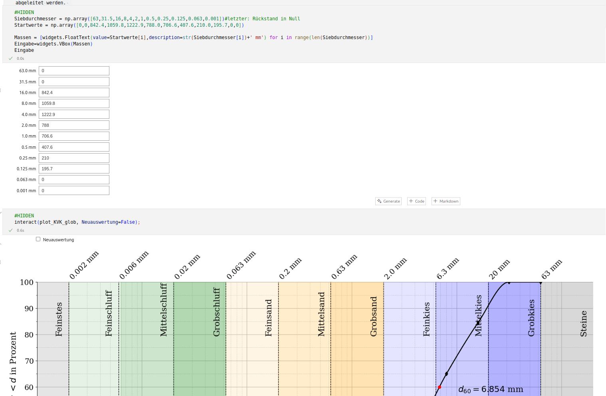

<!--

author:  Sebastian Zug, Andre Dietrich

import: https://raw.githubusercontent.com/liaTemplates/PyScript/main/README.md

persistent: true

@path
``` python @PyScript.env
- paths:
  - @0
```
@end

value_input: <span style="display: inline-block; min-width: 9rem">@1:</span> <script 
                input="range"
                output="@0"
                value=@2
                input-always-active
                min="@3"
                max="@4"
                step="0.1"
                modify="false"
            >
            const elements = document.getElementsByClassName("inert");

            for (let i = 0; i < elements.length; i++) {
                elements[i].setAttribute("inert", "");
            }

            setTimeout(() => {
                for (let i = 0; i < elements.length; i++) {
                    elements[i].removeAttribute("inert");
                }
            }, 500);

            @input
            </script>

@python_evaluate
<script class="inert" style="display: block" modify="false" run-once>
`LIASCRIPT:
\`\`\` python @PyScript.repl
@0
\`\`\`
`
</script>
@end
-->

[]([https://liascript.github.io/course/?](https://liascript.github.io/course/?https://raw.githubusercontent.com/LiaPlayground/Jupyter2Liascript/refs/heads/main/presentation_separateFunc.md#1))


# Beschreibung von Kornverteilungskurven


Im Zuge der Bestimmung einer Sieblinie werden Siebrückstände $m_i$ ermittelt. Die einzelnen zu den Siebdurchmessern $d_i$ gehörigen Siebrückstände $m_i$ können nun auf die Gesamtmasse $m_\text{d} = \sum m_i$ (Annahme vernachlässigbarer Siebverluste) bezogen werden, womit die Masseanteile

$$
    x_i = \frac{m_i}{m_\text{d}}
$$

ermittelt werden. Diese werden typischerweise in einer Summenkurve

$$
    F(d_i) = \sum \limits_{k=1}^i x_i
$$

aufgetragen. Dabei wird aufgrund der über Größenordnungen verteilten Korndurchmesser eine halblogarithmische Darstellung gewählt (siehe folgende Abbildung, rechts). Feinanteile, die nicht durch Siebung näher untersucht werden, sind nicht mit dargestellt. In der linken Abbildung sind die Masseanteile selbst und das zugehörige Histogramm der Masseverteilung dargestellt.

Mithilfe der Körnungslinie bzw. Kornverteilungskurve können die dominierenden Bestandteile (T, U, S, G) ermittelt werden. Des weiteren können die Ungleichförmigkeitszahl

$$
    C_U = \frac{d_{60}}{d_{10}}
$$

und die Krümmungszahl

$$
    C_C = \frac{d_{30}^2}{d_{10}\ d_{60}}
$$

abgeleitet werden. 

> Darauf aufbauend folgt dann ein interaktives Element, in den die Körnungsparameter eingegeben werden können und die Kornverteilungskurve neu berechnet wird.
> 
> 


## Variante 1: Interaktive Darstellung ohne Widgets

> Änderungen an den Körnungsparametern sind im Python Code vorzunehmen.

``` python @PyScript.env
- matplotlib
- scipy
- numpy
```

@[path](functions.py)

``` python @PyScript.repl
import matplotlib.pyplot as plt
import matplotlib.tri as tri
import numpy as np
import scipy as sp
from scipy import interpolate
from matplotlib.colors import SymLogNorm
from functions import *

Siebdurchmesser = np.array([63,31.5,16,8,4,2,1,0.5,0.25,0.125,0.063,0.001])
Startwerte = np.array([0,0,842.4,1059.8,1222.9,788.0,706.6,407.6,210.0,195.7,0,0])
plot_KVK_glob(True, Startwerte, Siebdurchmesser)
plt.show()
plt
```

## Variante 2: Interaktive Darstellung mit Widgets und sichtbarem Code

> Für das Triggern der neuen Berechnung und Ausgabe muss nach der Änderung der Werte der grüne Button in der Ecke beider, aufeinander aufbauender Codeblöcke aktiviert werden.

@value_input(a,$63.0\ \text{mm}$,0,-100,200) \
@value_input(b,$31.5\ \text{mm}$,0,-100,200) \
@value_input(c,$16.0\ \text{mm}$,842.4,-100,2000) \
@value_input(d,$ 8.0\ \text{mm}$,1059.8,-100,2000) \
@value_input(e,$ 4.0\ \text{mm}$,1222.9,-100,2000) \
@value_input(f,$ 2.0\ \text{mm}$,788.0,-100,2000) \
@value_input(g,$ 1.0\ \text{mm}$,706.6,-100,2000) \
@value_input(h,$ 0.5\ \text{mm}$,407.6,-100,2000) \
@value_input(i,$ 0.25\ \text{mm}$,210.0,-100,2000) \
@value_input(j,$ 0.125\ \text{mm}$,195.7,-100,2000) \
@value_input(k,$ 0.063\ \text{mm}$,0,-100,200) \
@value_input(l,$ 0.001\ \text{mm}$,0,-100,200)


``` python @python_evaluate
input_values = [@input(`a`), @input(`b`), @input(`c`), @input(`d`), @input(`e`), @input(`f`), @input(`g`), @input(`h`), @input(`i`), @input(`j`), @input(`k`), @input(`l`)]
print(input_values)
```

@[path](functions.py)

``` python @PyScript.repl
import matplotlib.pyplot as plt
import matplotlib.tri as tri
import numpy as np
import scipy as sp
from scipy import interpolate
from matplotlib.colors import SymLogNorm
from functions import *

Siebdurchmesser = np.array([63,31.5,16,8,4,2,1,0.5,0.25,0.125,0.063,0.001])
Startwerte = np.array(input_values)
plot_KVK_glob(True, Startwerte, Siebdurchmesser)
plt.show()
plt
```

## Variante 3: Automatische Weiterleitung von Änderungen an die Darstellung

> Die Darstellung wird automatisch aktualisiert, sobald der Werte geändert wurden.

@value_input(a,$63.0\ \text{mm}$,0,-100,200) \
@value_input(b,$31.5\ \text{mm}$,0,-100,200) \
@value_input(c,$16.0\ \text{mm}$,842.4,-100,2000) \
@value_input(d,$ 8.0\ \text{mm}$,1059.8,-100,2000) \
@value_input(e,$ 4.0\ \text{mm}$,1222.9,-100,2000) \
@value_input(f,$ 2.0\ \text{mm}$,788.0,-100,2000) \
@value_input(g,$ 1.0\ \text{mm}$,706.6,-100,2000) \
@value_input(h,$ 0.5\ \text{mm}$,407.6,-100,2000) \
@value_input(i,$ 0.25\ \text{mm}$,210.0,-100,2000) \
@value_input(j,$ 0.125\ \text{mm}$,195.7,-100,2000) \
@value_input(k,$ 0.063\ \text{mm}$,0,-100,200) \
@value_input(l,$ 0.001\ \text{mm}$,0,-100,200)

@[path](functions.py)

``` python @python_evaluate
import matplotlib.pyplot as plt
import matplotlib.tri as tri
import numpy as np
import scipy as sp
from scipy import interpolate
from matplotlib.colors import SymLogNorm
from functions import *
input_values = [@input(`a`), @input(`b`), @input(`c`), @input(`d`), @input(`e`), @input(`f`), @input(`g`), @input(`h`), @input(`i`), @input(`j`), @input(`k`), @input(`l`)]

Siebdurchmesser = np.array([63,31.5,16,8,4,2,1,0.5,0.25,0.125,0.063,0.001])
Startwerte = np.array(input_values)
plot_KVK_glob(True, Startwerte, Siebdurchmesser)
plt.show()
plt
```

## Lessons Learned

+ Die Interation von purem Python Code ist mit PyScript unglaublich einfach geworden.
+ Die in den Notebooks verwendenten Bibliotheken (`matplotlib`, `scipy`, `numpy`) sind in PyScript verfügbar, die Dauer des Ladens ist vertretbar.
+ Die Bibliotheken mussten in der angegebenen Reihung eingebunden werden, weil es sonst einen Fehler für Scipy gab.

  ``` 
     - matplotlib
     - scipy
     - numpy
  ```

+ Die Widgets es notwendig javascript Code für die Generierung des PyScript Blockes mit variablen Parametern zu verwenden. Darunter leidet die Les- und Testbarkeit des Codes. 
+ Die Berechnungsdauer für die Grafik beträgt etwa 2 Sekunden. 


